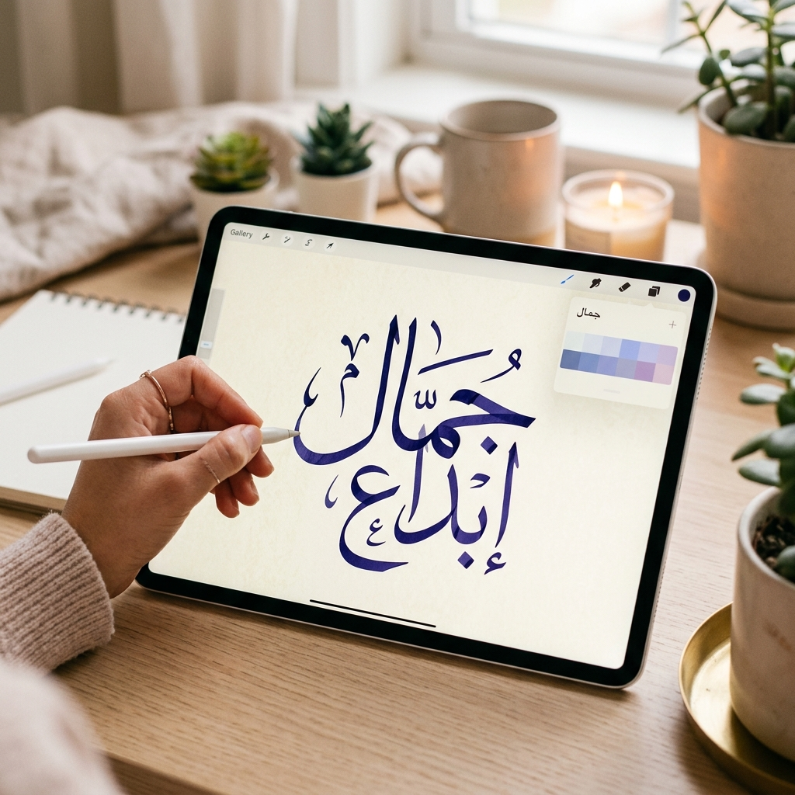
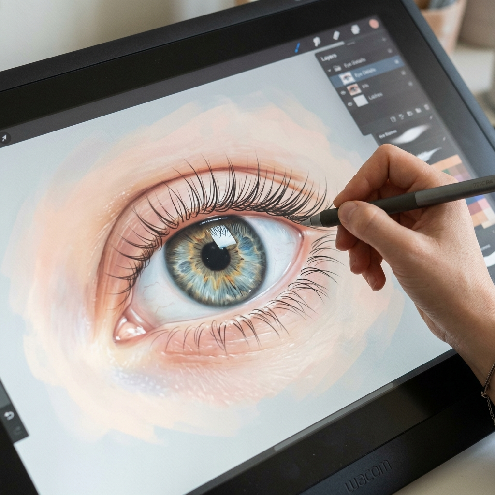
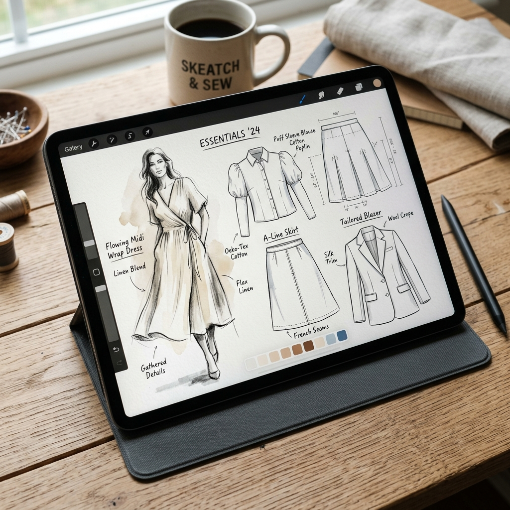
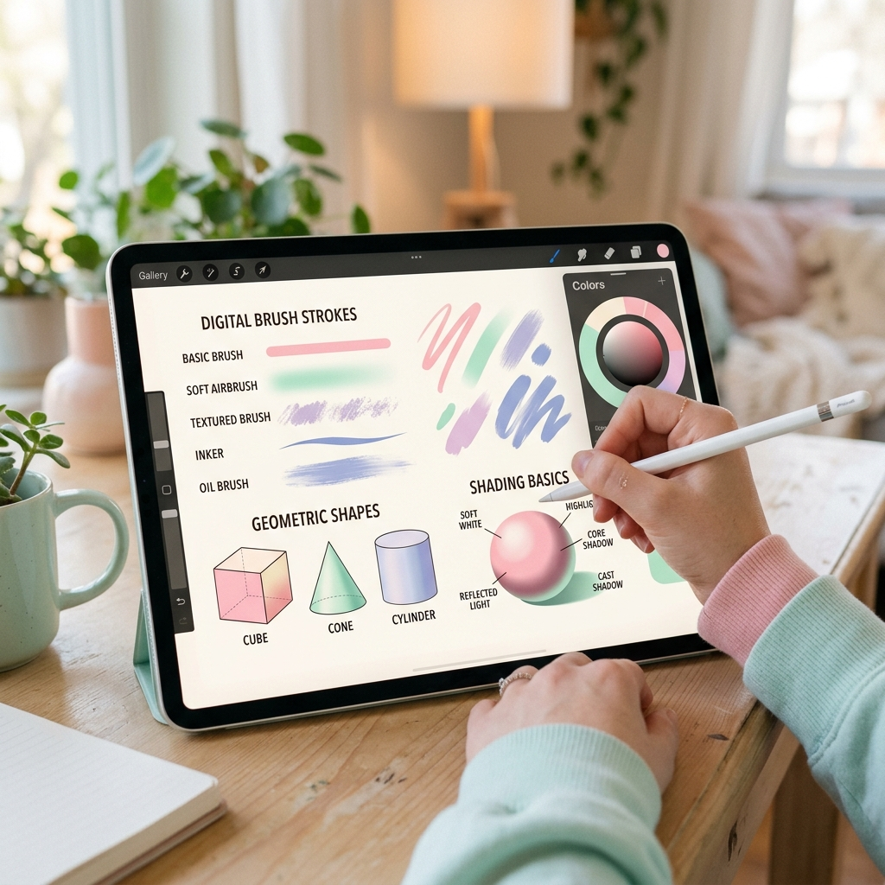

<!DOCTYPE html>
<html lang="ar" dir="rtl">
<head>
    <meta charset="UTF-8">
    <meta name="viewport" content="width=device-width, initial-scale=1.0">
    <title>متجر Ritalita للفرش الرقمية</title>
    <link href="https://fonts.googleapis.com/css2?family=Tajawal:wght@300;400;700;900&display=swap" rel="stylesheet">
    
</head>
<body>

    <nav>
        
🎨 Ritalita Brushes

        

            <a href="#">الرئيسية</a>
            <a href="#about">من نحن</a>
            <a href="#store">المتجر</a>
            <a href="#contact">تواصل معنا</a>
            <a href="#" onclick="openFav(event)">❤️ المفضلة (0)</a>
            <a href="#" class="cart-btn-nav" onclick="openCart(event)">🛒 السلة (0)</a>
        

    </nav>

    <section class="hero">
        <h1>أرقى الفرش الرقمية لإبداعك</h1>
        
اكتشف مجموعتنا الحصرية والاحترافية من الفرش الرقمية المُصممة بعناية فائقة لتسهل عليك رسم العيون، الأزياء، الخطوط العربية، والتفاصيل الدقيقة بكل احترافية وواقعية.

    </section>

    <section class="about-section" id="about">
        <h2>نبذة عني وعن مشروعي 🖌️</h2>
        
مرحباً! أنا ريتاليتا، فتاة شغوفة جداً بالرسم الرقمي وأحب أن أرى الفن منتشراً في العالم لأنه لغة ومساحة إبداع بلا حدود. من خلال مسيرتي الفنية وتجاربي، لاحظت مدى أهمية تفاصيل الفرشاة في جودة وسرعة العمل النهائي وإظهار الروح في اللوحة. لذلك، قمت بإطلاق مشروع <b>Ritalita Brushes</b> ليقدم فُرشاً رقمية احترافية صُممت بدقة عالية، سواء للمهتمين بتصميم الأزياء، أو رسم الخطوط العربية المعقدة، أو رسم الملامح التفصيلية كالعيون.

         
        
هدفي هو تزويد الرسامين والمصممين بأدوات تجعل من عملية الرسم متعة حقيقية، مع توفير ميزة "التجربة المجانية" لكل فرشة لضمان جودتها قبل الشراء!

    </section>

    <section class="products-section" id="store">
        <h2>مكتبة الفرشات المتاحة</h2>
        

            <input type="text" id="searchInput" class="search-input" placeholder="ابحث عن فرشة..." onkeyup="filterBrushes()">
        

        

            
            
            <!-- Product 1 -->
            

                <button class="btn-favorite" onclick="toggleFavorite(this, 'حزمة الخطوط العربية', './calligraphy_ipad_1776422765811.png', 50)">❤</button>
                
                <h3>حزمة الخطوط العربية</h3>
                
⭐⭐⭐⭐⭐ (5.0)

                
مجموعة فرش مصممة لمحاكاة الحبر وتفاصيل الخطوط العربية الكلاسيكية والحديثة.

                
٥٠ ريال

                

                    <button class="btn-buy" onclick="addToCart('حزمة الخطوط العربية', 50)">شراء الآن</button>
                    <button class="btn-trial">تجربة مجانية</button>
                

            

            <!-- Product 2 -->
            

                <button class="btn-favorite" onclick="toggleFavorite(this, 'حزمة رسم العيون والملامح', './eye_drawing_1776422806033.png', 45)">❤</button>
                
                <h3>حزمة رسم العيون والملامح</h3>
                
⭐⭐⭐⭐⭐ (4.9)

                
تشمل فرش للرموش، وتفاصيل بؤبؤ العين، وتدرجات الجلد الناعمة للرسم الواقعي.

                
٤٥ ريال

                

                    <button class="btn-buy" onclick="addToCart('حزمة رسم العيون والملامح', 45)">شراء الآن</button>
                    <button class="btn-trial">تجربة مجانية</button>
                

            

            <!-- Product 3 -->
            

                <button class="btn-favorite" onclick="toggleFavorite(this, 'فرش تصميم الأزياء (خيوط)', './fashion_sketch_1776422848574.png', 60)">❤</button>
                
                <h3>فرش تصميم الأزياء (خيوط)</h3>
                
⭐⭐⭐⭐⭐ (4.8)

                
فرش مخصصة لمحاكاة الخياطة، الأقمشة، وطيات الملابس لمصممي الأزياء.

                
٦٠ ريال

                

                    <button class="btn-buy" onclick="addToCart('فرش تصميم الأزياء (خيوط)', 60)">شراء الآن</button>
                    <button class="btn-trial">تجربة مجانية</button>
                

            

            <!-- Product 4 -->
            

                <button class="btn-favorite" onclick="toggleFavorite(this, 'حزمة الأساسيات المتنوعة', './digital_shapes_1776422866840.png', 40)">❤</button>
                
                <h3>حزمة الأساسيات المتنوعة</h3>
                
⭐⭐⭐⭐ (4.7)

                
تشمل قوالب وأساسيات رسم تساعد في تسريع عملية إنهاء الأعمال المعقدة.

                
٤٠ ريال

                

                    <button class="btn-buy" onclick="addToCart('حزمة الأساسيات المتنوعة', 40)">شراء الآن</button>
                    <button class="btn-trial">تجربة مجانية</button>
                

            

        

    </section>

    <section class="contact-section" id="contact">
        <h2>للتواصل والدعم</h2>
        
نحن هنا للرد على كافة استفساراتكم ومساعدتكم في استخدام الفرش.

        
        

            <!-- رابط الواتساب مباشر -->
            <a href="https://wa.me/966574987714" target="_blank" class="contact-card">
                💬
                تواصل عبر واتساب: 0574987714
            </a>

            <!-- رابط الإيميل -->
            <a href="mailto:rooo83799@gmail.com" class="contact-card">
                ✉️
                راسلنا على الإيميل: rooo83799@gmail.com
            </a>
        

    </section>

    <!-- واجهة المفضلة -->
    

    

        

            <h2 class="cart-title">❤️ مفضلاتي</h2>
            <button class="close-cart" onclick="closeFav()">×</button>
        

        
        

            
لا توجد فرش مفضلة حالياً 😢

        

    

    <!-- واجهة سلة المشتريات (Cart Modal) -->
    

    

        

            <h2 class="cart-title">🛍️ سلة مشترياتك</h2>
            <button class="close-cart" onclick="closeCart()">×</button>
        

        
        

            
السلة فارغة حالياً 😢

            <!-- العناصر تضاف هنا عبر الجافاسكربت -->
        

        

            

                المجموع الكلي:
                ٠ ريال
            

            
            

                <!-- أيقونات طرق الدفع -->
                
 Pay

                
VISA

                
Master

                
Mada

            

            <button class="btn-checkout" onclick="checkout()">إتمام الدفع الآمن</button>
        

    

    <!-- كود الجافاسكربت لإدارة السلة والمفضلة والبحث -->
    
</body>
</html>
